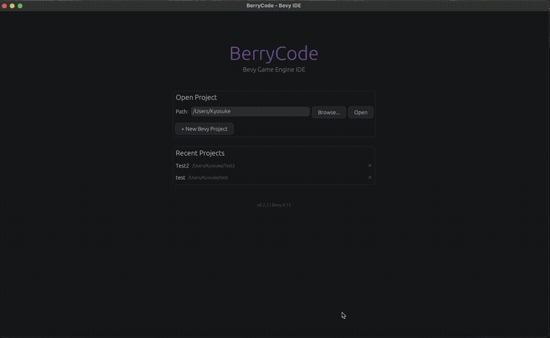
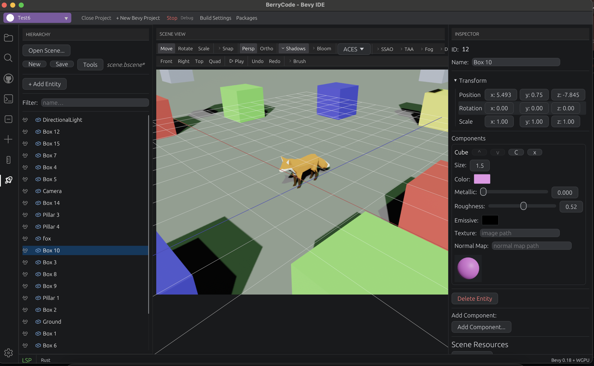
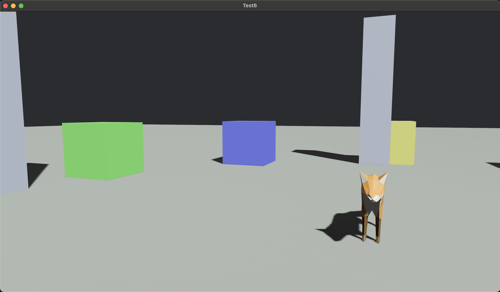
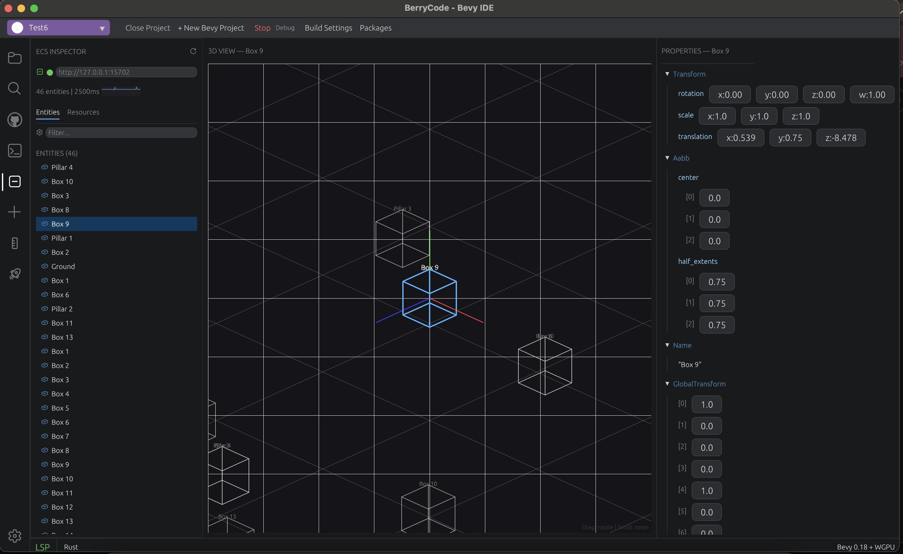
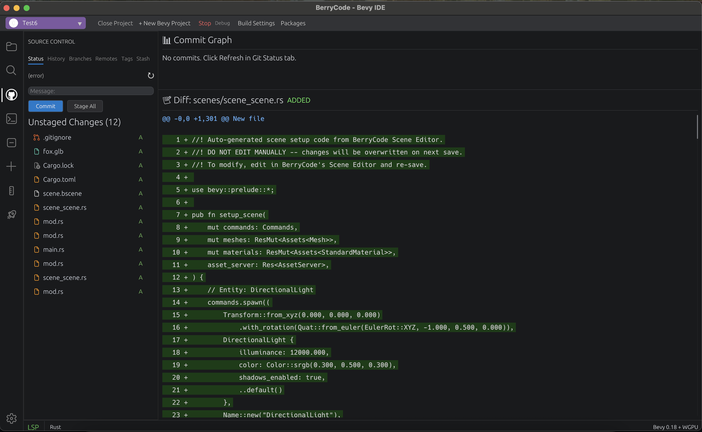
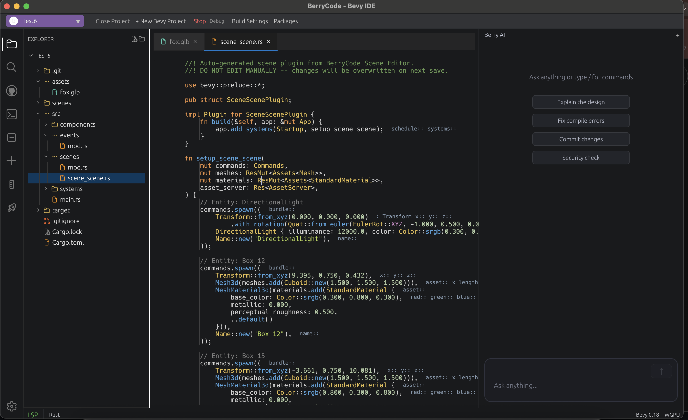

# BerryCode - The IDE Built for Bevy

[](https://github.com/KyosukeIshizu1008/berryscode/actions/workflows/tests.yml)
[](LICENSE)
[](https://crates.io/crates/berrycode)
[](https://github.com/KyosukeIshizu1008/berryscode/releases)
[](https://discord.gg/u5VYs7za)

[](https://github.com/sponsors/KyosukeIshizu1008)
[](https://opencollective.com/berrycode)
[](https://ko-fi.com/berrycode)
[](https://liberapay.com/berrycode/)
[](https://issuehunt.io/r/KyosukeIshizu1008/berryscode)

[English](#english) | [日本語](#japanese)

---

<a name="english"></a>

## English

**The first IDE purpose-built for the Bevy game engine.**

BerryCode is not a general-purpose editor with Bevy plugins bolted on — it's an IDE designed from the ground up for Bevy development. Built entirely in Rust with Bevy + bevy_egui + WGPU, it understands Bevy's ECS architecture, scene format, and development workflow natively.

> **Why not just use VS Code?**
> VS Code treats Bevy as "just another Rust project." BerryCode treats Bevy as a first-class game engine — with a built-in Scene Editor, ECS Inspector, System Graph, and more. No extensions needed.

### Demo

<p align="center">
  <video src="https://github.com/KyosukeIshizu1008/berryscode/raw/main/docs/demo/demo.mp4" width="80%" autoplay loop muted playsinline>
    
  </video>
</p>

### Screenshots

| Scene Editor | Game Runtime |
|:---:|:---:|
|  |  |

| ECS Inspector | Git Integration |
|:---:|:---:|
|  |  |

| Code Editor + AI Chat |
|:---:|
|  |

### What Makes BerryCode Different

| Feature | VS Code + Extensions | BerryCode |
|---------|---------------------|-----------|
| Scene editing | Text-only `.scn.ron` | Visual 3D viewport with gizmos |
| ECS inspection | None | Live entity/component/resource browser |
| System ordering | None | Visual system dependency graph |
| Bevy events | `println!` debugging | Real-time event monitor |
| Play in editor | Switch to terminal | Run with integrated console output |
| Bevy templates | Manually type boilerplate | One-click Component/System/Plugin generation |
| Plugin discovery | Search crates.io manually | Built-in Bevy plugin browser |
| Built with | Electron (web tech) | Bevy + WGPU (same stack as your game) |

### Bevy-Native Tools

These tools understand Bevy's architecture — they're not generic wrappers.

#### Scene Editor (Unity-class)
- 3D viewport with translate/rotate/scale gizmos (`W`/`E`/`R`)
- VS Code-style panel headers and compact toolbar layout
- Entity hierarchy with file-tree-style rendering (Codicon icons, full-row selection, indent guides)
- Inspector with type-aware component editors (Vec3, Color, Handle, etc.)
- Prefab system — create, instantiate, override
- Multi-scene tabs with independent undo/redo
- Export to `.scn.ron` (Bevy native) or `.bscene` (binary)

#### ECS Inspector
- Connect to a running Bevy app via BRP (Bevy Remote Protocol)
- Browse entities, components, and resources in real-time
- Filter and search by component type
- Auto-refresh with connection status indicator

#### System Graph
- Visualize system execution order and dependencies
- Identify bottlenecks and ordering issues
- Understand schedule topology at a glance

#### Event Monitor
- Real-time log of all Bevy events
- Filter by event type
- Inspect event payloads

#### Query Visualizer
- See which entities match a given query
- Performance metrics per query
- Optimization hints

#### State Editor
- View and manage Bevy `States` enum variants
- Manually trigger state transitions for testing

#### Bevy Templates
- Generate `Component`, `Resource`, `System`, `Plugin`, `Event`, `State` boilerplate
- Dynamic field/parameter input
- Insert directly at cursor position

#### Plugin Browser
- Search crates.io for Bevy-compatible plugins
- View metadata (version, downloads, description)
- One-click add to `Cargo.toml`

#### Animation System
- Timeline editor with keyframe scrubbing
- Dopesheet for per-property keyframe editing
- Animator editor with clip selection and blend controls

#### Additional Scene Tools
- Visual Scripting (node-based, Blueprint-style)
- Shader Graph editor with live preview
- Material preview with PBR properties
- Terrain editor, Skeleton/Rig editor, Navmesh generator
- Physics simulator, Particle preview

### Also a Full-Featured Code Editor

BerryCode isn't just Bevy tools — it's a complete Rust IDE.

- **LSP** — completions, hover, go-to-definition, references, diagnostics, format, rename, code actions, inlay hints, macro expansion
- **Syntax highlighting** — Rust, Python, JavaScript, C/C++, TOML, Markdown (Tree-sitter + Syntect)
- **Vim mode** — full modal editing (Normal, Insert, Visual, Command, Replace) with operators, text objects, registers, marks, dot repeat
- **Terminal** — iTerm2-class PTY emulator (VT100/xterm, ANSI 256 colors, 10K scrollback, multi-tab)
- **Git** — 6-tab panel (Status, History, Branches, Remotes, Tags, Stash) with commit graph and diff viewer
- **Search** — project-wide regex search with parallel execution (Rayon)
- **Debugger** — variables, call stack, watch expressions, breakpoints (DAP)
- **AI Chat** — integrated LLM assistant via gRPC
- **Minimap, code folding, snippets, image/3D model preview, test runner**

### Install

#### Pre-built binaries (recommended)

Grab the latest release artifact for your platform from the
[Releases page](https://github.com/KyosukeIshizu1008/berryscode/releases/latest):

| Platform | Artifact |
|----------|----------|
| macOS (Apple Silicon + Intel) | `berrycode-macos-universal.tar.gz` |
| Linux (x86_64) | `berrycode-linux-x86_64.tar.gz` |
| Windows (x86_64) | `berrycode-windows-x86_64.zip` |

Releases are signed with [Sigstore](https://www.sigstore.dev/).

#### Package managers

```bash
# macOS / Linux — Homebrew
brew install berrycode

# Windows — winget
winget install KyosukeIshizu1008.BerryCode

# Linux — Snap
sudo snap install berrycode

# Linux — Flatpak
flatpak install flathub dev.berrycode.BerryCode

# Cargo (any platform with Rust 1.75+)
cargo install berrycode
```

#### Build from source

```bash
git clone https://github.com/KyosukeIshizu1008/berryscode
cd berryscode
cargo run --bin berrycode               # debug
cargo build --release --bin berrycode   # release

# AI features (optional)
cd berry_api && cargo run               # terminal 1
cargo run --bin berrycode               # terminal 2
```

**Prerequisites**: Rust 1.75+ | Linux: `libx11-dev libasound2-dev libudev-dev libpipewire-0.3-dev`

### Roadmap

BerryCode is in active development. The next milestones in priority order:

The arc:
**v0.4–v0.7** = core editor + first non-game wedge (architecture).
**v0.8–v0.9** = the runtime story (ship to mobile, then connect players online).
**v0.10–v0.12** = the publishing story (data, testing, store + i18n).
**v1.0** = team-scale IDE.

#### v0.4 — Editor polish (target: 2026 Q3)
- [ ] GPU PBR preview for GLB/GLTF models ([#1](https://github.com/KyosukeIshizu1008/berryscode/issues/1))
- [x] In-progress IME preedit display in source code editor
- [x] LSP: completion details (signature help, parameter hints)
- [ ] Scene Editor: prefab nested overrides ([#10](https://github.com/KyosukeIshizu1008/berryscode/issues/10))
- [x] Settings UI for keybindings and theme

#### v0.4.5 — AI integration (target: 2026 Q4 / mid)

> _AI-native, Bevy-aware._ Bring-your-own-key support for the major
> code-savvy models for chat, plus subprocess integration with **Codex
> CLI** and **Claude Code** for the heavyweight agent / apply-diff
> features — leveraging mature external tools instead of
> reimplementing the autonomous loop in Rust.

**Chat surface (BYOK, in-process)**

- [x] **Provider plug-in layer**: Anthropic (Claude Opus 4.7 / Sonnet 4.6 / Haiku 4.5), OpenAI (GPT-5 / GPT-5 Codex), Ollama / llama.cpp (local), with prompt caching where supported
- [x] **Bring-your-own-key UI**: per-provider keys + model selection in Settings; never round-trip through a hosted backend
- [x] **Cost / token panel**: per-conversation usage + monthly cap so users never get surprise bills
- [x] **Chat sidebar (`Cmd+L`)** — `Cmd+L` shortcut focuses the chat input from anywhere
- [ ] **Chat attachments**: `@file` / `@symbol` / `@scene` to inject project context
- [ ] **Inline / Tab completion**: ghost-text suggestions across Rust, Bevy `.scn.ron`, shaders, and TOML

**Agent surface (subprocess, both CLIs)**

- [x] **Agent mode (Claude Code)**: spawn `claude --print --output-format=stream-json` with the project root as `--add-dir`; stream the JSON-Lines event channel into the chat panel; auto-record token usage in the cost log
- [x] **Agent mode (Codex CLI)**: equivalent path via `codex exec --json --cd <cwd> --full-auto`; backend picker in the chat panel lets users pick per task
- [x] **Apply diff**: agent edit proposals (`Edit` / `Write` / `MultiEdit` tool invocations) surface as Approve / Reject cards above the chat input; approving writes the file and reloads any open editor tab
- [ ] **3-way merge**: apply edits cleanly when the buffer has been modified since the agent read it
- [ ] **Bevy doc RAG**: auto-attach the relevant Bevy 0.18 docs / examples to chat prompts (in-process); agent runs already see the project source tree directly through `--add-dir`
- [ ] **ECS-aware completion**: typing `commands.spawn(` lists Components present in the current scene; system signatures suggest queries that actually compile

Positioning: the first AI assistant that *understands* Bevy, not just Rust — backed by the same agent tooling expert Rust developers already trust.

#### v0.5 — Bevy depth + asset import (target: 2026 Q4)
- [x] System Graph: drag-to-reorder + visual scheduling
- [x] Animation: blend tree node graph editor
- [x] Shader Graph: live-recompile preview
- [x] Hot reload for `.bscene` and shader assets
- [x] Plugin Browser: install with one click + auto-update
- [x] **Asset import pipeline**: FBX, OBJ, glTF variants, custom converter plugins (foundation that v0.6 / v0.7 build on)

#### v0.6 — Audio pipeline (target: 2027 H1)

> _The audio half of game development, brought into the IDE._ An
> open-source FMOD / Wwise alternative tuned for Bevy.

- [x] **Asset preview**: in-IDE waveform display + scrubbing for any audio file (WAV in v0.6.0; mp3 / ogg / flac via symphonia in v0.6.1)
- [x] **Event-driven editor**: define one-shots, loops, ducking, and parameter-driven layers (data + UI; `events.fire()` runtime in v0.6.1)
- [x] **Spatial audio**: visualise 3D source placement / attenuation curves on top of the Scene Editor viewport (component + inspector + attenuation curves; SpatialAudioSink runtime in v0.6.1)
- [x] **Music graph**: BGM transitions, stinger / cue triggers, vertical re-mixing (data + node-graph editor; crossfade runtime in v0.6.1)
- [x] **SFX randomiser**: pitch / volume / variation tables to avoid repetitive sound (data + inspector; runtime spawn in v0.6.1)
- [x] **Hot reload**: edit a sound and hear it in the running game without restart (file watcher + preview re-decode; Bevy asset reload in v0.6.1)

#### v0.7 — Architecture → game pipeline (target: 2027 H2)

> _Bring your buildings to life._ Treat the artifacts that architects, BIM
> engineers, and archviz studios already produce as first-class Bevy
> assets — no Blender / Unreal detour required.

- [ ] **Native CAD importers**: DWG / DXF / IFC (BIM) / STEP / IGES / SketchUp `.skp`, plus a Revit → IFC bridge
- [ ] **Auto-prep for real-time rendering**: Z-up → Y-up, mm → m, LOD synthesis, UV unwrap, layer-name → PBR material inference (`Wall` → masonry, `Glass` → transmissive, `Floor` → tiled, …)
- [ ] **Walkable scene scaffolding**: collision auto-generation, first-person walkthrough template, day/night lighting presets, door / elevator interaction defaults
- [ ] **Targets**: architecture firms shipping client demos, real-estate viz, BIM-driven digital twins, Quest / Vision Pro VR walkthroughs

Positioning: an open-source Bevy-based alternative to Twinmotion / Enscape / Datasmith.

#### v0.8 — Ship to phones from one IDE (target: 2028 H1)

> _Bevy mobile development without the toolchain hell._ Replace the
> cargo-mobile + Xcode + Android Studio + SDK juggling with a single
> integrated workflow.

- [ ] **Toolchain setup**: one-click iOS / Android targets, auto-detect missing SDK / NDK / simulators, manage signing certs & keystores from the IDE
- [ ] **Deploy & run**: one-click deploy to device or simulator, unified log / crashtrace console, **WiFi hot reload** for asset edits
- [ ] **Mobile-aware editor**: visual touch-input editor (virtual joysticks, tap zones, gestures), safe-area / notch / orientation-aware layouts, mobile UI templates, auto texture compression (ASTC / ETC2), mobile LOD presets
- [ ] **Performance**: integrated GPU profiler (Metal frame capture / RenderDoc Android), frame-budget visualisation, battery-cost estimator, lifecycle (Background / Foreground / Lock) test harness
- [ ] **Ship**: IPA / AAB build & signing inside the IDE, App Store Connect / Play Console upload helper, TestFlight & internal-test QR generator
- [ ] **VR/AR bonus**: Vision Pro / Quest builds reuse the v0.7 walkable scenes — pipeline becomes "CAD → walkthrough → headset" in one tool

#### v0.9 — Networking & multiplayer (target: 2028 H2)

> _Online games stop being a separate project._ First-class integration
> with the Bevy netcode ecosystem.

- [ ] **`lightyear` / `bevy_replicon` integration**: project templates, replication-rule editor, lag compensation toggles
- [ ] **Rollback / interpolation visualiser**: see frame-by-frame what the predictor and reconciler are doing
- [ ] **N-client local launcher**: start 4 clients + 1 server in one click, stress-test interactions
- [ ] **Network condition simulator**: latency / packet loss / bandwidth caps applied per client
- [ ] **Server packaging**: dedicated-server binary, Dockerfile generation, one-button deploy to Fly.io / Railway / a Kubernetes cluster
- [ ] **Auth & matchmaking starters**: pluggable backends so indie devs don't reinvent leaderboards each time

#### v0.10 — Game Data Inspector (target: 2029 H1)

> _ECS and the database in one pane._ A DB viewer purpose-built for
> game development — save files, live multiplayer back-ends, and the
> Bevy asset cache are first-class, not an afterthought.

- [ ] **Connections**: SQLite / Postgres / MySQL / Redis / sled, with auto-detection of save-file paths inside a Bevy project
- [ ] **Browser UI**: table / KV navigation that mirrors the ECS Inspector (same filter, search, and column-pinning UX)
- [ ] **Query editor**: SQL with syntax highlighting + completion via the existing Tree-sitter / LSP plumbing
- [ ] **Schema diagrams**: ER view rendered with the same node-graph layer as the System Graph
- [ ] **Live save-file editing**: rewrite a running game's save and hot-reload without restarting
- [ ] **ECS ↔ DB bridge**: visualise how Bevy Components map to rows / columns and trace persistence flow
- [ ] **Migrations**: track schema changes alongside save-file compatibility so old saves don't silently break

Positioning: not a DataGrip clone — a game-data debugger that ships in the same IDE as the Scene Editor and ECS Inspector.

#### v0.11 — Testing & QA (target: 2029 H2)

- [ ] **Gameplay recording / replay**: deterministic capture of input + RNG seed, replay on demand
- [ ] **AI playtesting agent**: random / heuristic / RL agent that wanders the scene to surface crashes and stuck states
- [ ] **Visual regression tests**: per-scene screenshot diff against a baseline, integrated into CI
- [ ] **Performance regression tracking**: frame-time budgets per scene, alert on regressions over time
- [ ] **Bug-report bundler**: one-click collect logs + save state + screenshot + system info into a shareable archive

#### v0.12 — Publishing & i18n (target: 2030 H1)

- [ ] **Steam / itch.io / GOG / Epic integration**: build → upload via butler / SteamPipe / Epic's tooling, all from the IDE
- [ ] **Store asset manager**: icons, trailers, screenshots, capsules — sized & previewed for each storefront's requirements
- [ ] **Achievements & cloud saves**: define achievement schemas once, generate per-store integration code
- [ ] **Localisation tables**: spreadsheet-style translation manager with translator workflow (review, lock, missing-key reports)
- [ ] **Auto font fallback**: detect target locales and switch fonts (CJK, Arabic RTL, Devanagari) without manual setup
- [ ] **Translation memory + AI assist**: leverage prior translations and optional LLM suggestions, human-reviewed

#### v1.0 — Team-scale IDE (target: 2030 H2)

- [ ] **Multi-cursor + CRDT collaborative editing** — multiple devs in the same scene / file
- [ ] **Visual scripting → Rust codegen** — designers contribute logic without writing Rust by hand
- [ ] **Profiler integration (Bevy + Tracy)** — promoted from earlier WIP into stable
- [ ] **Project / workspace management** — for studios juggling many BerryCode projects
- [ ] **Stabilisation** — settings migration, deprecation policy, plugin API freeze

#### Beyond v1.0
- [ ] WASM build for in-browser editing
- [ ] Cloud sync for workspaces

See [open issues](https://github.com/KyosukeIshizu1008/berryscode/issues) for the current backlog and
[Discussions](https://github.com/KyosukeIshizu1008/berryscode/discussions) to suggest new directions.

### Community

Join us on [Discord](https://discord.gg/u5VYs7za) for questions, feedback, and discussion.

### Architecture

BerryCode runs on the same technology stack as your Bevy game:

| Layer | Technology |
|-------|-----------|
| Engine | **Bevy 0.18** |
| Rendering | **WGPU** (Metal / Vulkan / DX12) |
| UI | bevy_egui 0.39 + egui 0.33 |
| Text Buffer | Ropey (rope-based) |
| Syntax | Tree-sitter + Syntect |
| Terminal | portable-pty + VTE |
| Git | libgit2 |
| Search | Rayon + regex |
| LSP | lsp-types (native) |
| AI | gRPC (tonic + prost) |
| 3D Assets | gltf, tobj, image |

### Platform Support

| Platform | Backend | Status |
|----------|---------|--------|
| macOS | Metal | Supported |
| Linux | Vulkan / OpenGL | Supported |
| Windows | DirectX 12 | Supported |

---

<a name="japanese"></a>

## 日本語

**Bevy ゲームエンジン専用に作られた、初めての IDE。**

BerryCode は汎用エディタに Bevy プラグインを後付けしたものではありません。Bevy の ECS アーキテクチャ、シーンフォーマット、開発ワークフローをネイティブに理解する、Bevy 開発のためにゼロから設計された IDE です。Rust + Bevy + bevy_egui + WGPU で構築 — あなたのゲームと同じ技術スタック。

> **VS Code じゃダメなの？**
> VS Code は Bevy を「ただの Rust プロジェクト」として扱います。BerryCode は Bevy をファーストクラスのゲームエンジンとして扱います — シーンエディタ、ECS インスペクター、システムグラフ等が組み込み済み。拡張機能は不要です。

### デモ

<p align="center">
  <video src="https://github.com/KyosukeIshizu1008/berryscode/raw/main/docs/demo/demo.mp4" width="80%" autoplay loop muted playsinline>
    
  </video>
</p>

### スクリーンショット

| シーンエディタ | ゲーム実行 |
|:---:|:---:|
|  |  |

| ECS インスペクター | Git 統合 |
|:---:|:---:|
|  |  |

| コードエディタ + AI チャット |
|:---:|
|  |

### BerryCode が他と違う点

| 機能 | VS Code + 拡張機能 | BerryCode |
|------|-------------------|-----------|
| シーン編集 | テキストで `.scn.ron` | ギズモ付き3Dビューポート |
| ECS 監視 | なし | ライブ エンティティ/コンポーネント/リソース ブラウザ |
| システム順序 | なし | ビジュアルシステム依存グラフ |
| Bevy イベント | `println!` デバッグ | リアルタイムイベントモニター |
| エディタ内プレイ | ターミナルに切替 | 統合コンソール出力付きで実行 |
| Bevy テンプレート | 手動でボイラープレート入力 | ワンクリック Component/System/Plugin 生成 |
| プラグイン検索 | crates.io を手動検索 | 組み込み Bevy プラグインブラウザ |
| 構築技術 | Electron (Web技術) | Bevy + WGPU (ゲームと同じスタック) |

### Bevy ネイティブツール

Bevy のアーキテクチャを理解した専用ツール群。

#### シーンエディタ (Unity クラス)
- 移動/回転/スケールギズモ付き3Dビューポート (`W`/`E`/`R`)
- VS Code 風パネルヘッダーとコンパクトなツールバーレイアウト
- ファイルツリー風のエンティティヒエラルキー (Codicon アイコン、フル幅選択、インデントガイド)
- 型対応コンポーネントエディタ付きインスペクター (Vec3, Color, Handle 等)
- プレハブシステム — 作成、インスタンス化、オーバーライド
- 独立した Undo/Redo 付きマルチシーンタブ
- `.scn.ron` (Bevy ネイティブ) / `.bscene` (バイナリ) エクスポート

#### ECS インスペクター
- BRP (Bevy Remote Protocol) 経由で実行中の Bevy アプリに接続
- エンティティ、コンポーネント、リソースをリアルタイムに閲覧
- コンポーネント型でフィルター・検索
- 自動リフレッシュ + 接続ステータスインジケーター

#### システムグラフ
- システム実行順序と依存関係を可視化
- ボトルネックと順序問題の特定

#### イベントモニター
- 全 Bevy イベントのリアルタイムログ
- イベント型でフィルタリング

#### クエリビジュアライザー
- 指定クエリにマッチするエンティティの確認
- クエリごとのパフォーマンスメトリクス

#### ステートエディタ
- Bevy `States` enum の表示・管理
- テスト用の手動ステート遷移

#### Bevy テンプレート
- `Component`, `Resource`, `System`, `Plugin`, `Event`, `State` のボイラープレート生成
- カーソル位置に直接挿入

#### プラグインブラウザ
- crates.io から Bevy 対応プラグインを検索
- ワンクリックで `Cargo.toml` に追加

#### アニメーションシステム
- キーフレーム付きタイムラインエディタ
- プロパティごとのドープシート
- クリップ選択・ブレンド付きアニメーターエディタ

#### その他のシーンツール
- ビジュアルスクリプト (ノードベース、Blueprint スタイル)
- ライブプレビュー付きシェーダーグラフエディタ
- PBR プロパティ付きマテリアルプレビュー
- テレインエディタ、スケルトン/リグエディタ、Navmesh ジェネレーター
- 物理シミュレーター、パーティクルプレビュー

### フル機能のコードエディタでもある

Bevy ツールだけではなく、完全な Rust IDE。

- **LSP** — 補完、ホバー、定義ジャンプ、参照検索、診断、フォーマット、リネーム、コードアクション、インレイヒント、マクロ展開
- **シンタックスハイライト** — Rust, Python, JavaScript, C/C++, TOML, Markdown (Tree-sitter + Syntect)
- **Vim モード** — フルモーダル編集 (Normal, Insert, Visual, Command, Replace) + オペレータ、テキストオブジェクト、レジスタ、マーク、ドットリピート
- **ターミナル** — iTerm2 クラス PTY エミュレータ (VT100/xterm, ANSI 256色, 10K スクロールバック, マルチタブ)
- **Git** — 6タブパネル (Status, History, Branches, Remotes, Tags, Stash) + コミットグラフ、差分ビューアー
- **検索** — プロジェクト全体の正規表現検索 (Rayon 並列)
- **デバッガー** — 変数、コールスタック、ウォッチ、ブレークポイント (DAP)
- **AI チャット** — gRPC 経由の統合 LLM アシスタント
- **ミニマップ、コード折りたたみ、スニペット、画像/3Dモデルプレビュー、テストランナー**

### インストール

#### ビルド済みバイナリ（推奨）

[Releases ページ](https://github.com/KyosukeIshizu1008/berryscode/releases/latest)から
プラットフォーム別にダウンロード:

| プラットフォーム | アーティファクト |
|------------------|------------------|
| macOS (Apple Silicon + Intel) | `berrycode-macos-universal.tar.gz` |
| Linux (x86_64) | `berrycode-linux-x86_64.tar.gz` |
| Windows (x86_64) | `berrycode-windows-x86_64.zip` |

リリースは [Sigstore](https://www.sigstore.dev/) で署名されています。

#### パッケージマネージャー

```bash
# macOS / Linux — Homebrew
brew install berrycode

# Windows — winget
winget install KyosukeIshizu1008.BerryCode

# Linux — Snap
sudo snap install berrycode

# Linux — Flatpak
flatpak install flathub dev.berrycode.BerryCode

# Cargo (Rust 1.75+ があればどのプラットフォームでも)
cargo install berrycode
```

#### ソースからビルド

```bash
git clone https://github.com/KyosukeIshizu1008/berryscode
cd berryscode
cargo run --bin berrycode               # デバッグビルド
cargo build --release --bin berrycode   # リリースビルド

# AI 機能 (オプション)
cd berry_api && cargo run               # ターミナル1
cargo run --bin berrycode               # ターミナル2
```

**前提条件**: Rust 1.75+ | Linux: `libx11-dev libasound2-dev libudev-dev libpipewire-0.3-dev`

### ロードマップ

BerryCode は活発に開発中です。優先順位順の今後のマイルストーン:

全体の流れ:
**v0.4–v0.7** = コアエディタ + 最初の非ゲーム wedge（建築）
**v0.8–v0.9** = ランタイムストーリー（モバイル → オンライン）
**v0.10–v0.12** = リリースストーリー（データ / テスト / ストア + 多言語）
**v1.0** = チーム規模で使える IDE

#### v0.4 — エディタの磨き込み (目標: 2026 Q3)
- [ ] GLB/GLTF モデルの GPU PBR プレビュー ([#1](https://github.com/KyosukeIshizu1008/berryscode/issues/1))
- [x] ソースコードエディタでの IME preedit 表示
- [x] LSP: 補完詳細（シグネチャヘルプ、パラメータヒント）
- [ ] シーンエディタ: プレハブのネストオーバーライド ([#10](https://github.com/KyosukeIshizu1008/berryscode/issues/10))
- [x] キーバインド・テーマの設定 UI

#### v0.4.5 — AI 統合 (目標: 2026 Q4 / 中盤)

> _AI ネイティブ、Bevy 対応。_ チャットは BYOK で主要モデル直叩き、
> 重量級のエージェント / Apply diff は **Codex CLI** と **Claude Code**
> を subprocess 経由で統合 — 自律ループを Rust で再実装するのではなく、
> 既に成熟した外部ツールを活用します。

**チャット面(BYOK、プロセス内)**

- [x] **プロバイダプラグイン層**: Anthropic (Claude Opus 4.7 / Sonnet 4.6 / Haiku 4.5)、OpenAI (GPT-5 / GPT-5 Codex)、Ollama / llama.cpp (ローカル)、対応モデルではプロンプトキャッシュ利用
- [x] **BYOK (Bring Your Own Key) UI**: プロバイダごとの API キー + モデル選択を Settings から設定、ホスト型バックエンド経由なし
- [x] **コスト / トークンパネル**: 会話ごとの使用量 + 月次キャップで予期せぬ請求を回避
- [x] **チャットサイドバー (`Cmd+L`)**: 任意の場所からチャット入力欄にフォーカス
- [ ] **チャット添付**: `@file` / `@symbol` / `@scene` でプロジェクトコンテキストを注入
- [ ] **インライン / Tab 補完**: ゴーストテキスト提案 (Rust、Bevy `.scn.ron`、シェーダー、TOML)

**エージェント面(subprocess、両 CLI 対応)**

- [x] **エージェントモード (Claude Code)**: `claude --print --output-format=stream-json` をプロジェクトルートを `--add-dir` で渡して spawn、JSON Lines イベントをチャットパネルにストリーム、トークン使用量を自動記録
- [x] **エージェントモード (Codex CLI)**: `codex exec --json --cd <cwd> --full-auto` で同等動作、チャットパネル内のバックエンドピッカーでタスクごとに切替可能
- [x] **Apply diff**: エージェントの編集提案 (`Edit` / `Write` / `MultiEdit` ツール呼び出し) はチャット入力上にカードで Approve / Reject 表示、承認するとファイル書き込み + 開いている編集タブを自動リロード
- [ ] **3-way merge**: エージェントが読んだ後にバッファが変更されていてもクリーンに適用
- [ ] **Bevy ドキュメント RAG**: チャットに Bevy 0.18 のドキュメント・例を自動添付(プロセス内)。エージェント実行は `--add-dir` 経由でプロジェクトソースを直接読める
- [ ] **ECS 対応補完**: `commands.spawn(` 入力で現シーンの Component を候補に、System シグネチャから実コンパイル可能な Query を提案

ポジショニング: ただの Rust ではなく **Bevy を理解する** 初の AI アシスタント。 — 経験豊富な Rust 開発者が既に信頼しているエージェントツールが裏で走ります。

#### v0.5 — Bevy 深耕 + アセットインポート (目標: 2026 Q4)
- [x] システムグラフ: ドラッグで順序変更 + 視覚的スケジューリング
- [x] アニメーション: ブレンドツリーノードグラフエディタ
- [x] シェーダーグラフ: ライブ再コンパイルプレビュー
- [x] `.bscene` とシェーダーアセットのホットリロード
- [x] プラグインブラウザ: ワンクリックインストール + 自動アップデート
- [x] **アセットインポートパイプライン**: FBX, OBJ, glTF 各種、カスタムコンバータプラグイン (v0.6 / v0.7 の基盤)

#### v0.6 — オーディオパイプライン (目標: 2027 H1)

> _ゲーム開発の半分を占める音をIDE 内で完結。_
> Bevy 向けに最適化された OSS の FMOD / Wwise 代替。

- [x] **アセットプレビュー**: あらゆる音声ファイルの波形表示 + IDE 内スクラブ再生(v0.6.0 は WAV のみ、symphonia 経由の mp3 / ogg / flac は v0.6.1)
- [x] **イベント駆動エディタ**: ワンショット、ループ、ダッキング、パラメータ駆動レイヤーの定義(データ + UI、`events.fire()` ランタイムは v0.6.1)
- [x] **空間オーディオ**: シーンエディタビューポートに 3D 音源・減衰カーブを重ねて可視化(コンポーネント + インスペクタ + 減衰カーブ、SpatialAudioSink ランタイムは v0.6.1)
- [x] **ミュージックグラフ**: BGM トランジション、スティンガー、垂直リミックス(データ + ノードエディタ、クロスフェードランタイムは v0.6.1)
- [x] **SFX ランダマイザ**: ピッチ・音量・バリエーションテーブルで効果音の繰り返し感解消(データ + インスペクタは実装、ランタイム生成は v0.6.1)
- [x] **ホットリロード**: 音を編集すると実行中ゲームに即反映(ファイル監視 + プレビュー再デコード、Bevy アセットリロードは v0.6.1)

#### v0.7 — 建築 → ゲーム パイプライン (目標: 2027 H2)

> _建物に命を吹き込む。_ 建築家・BIM エンジニア・archviz スタジオが既に
> 作っているデータをそのまま Bevy のアセットとして扱う —
> Blender や Unreal を経由する必要なし。

- [ ] **CAD ネイティブインポート**: DWG / DXF / IFC (BIM) / STEP / IGES / SketchUp `.skp`、Revit → IFC ブリッジ
- [ ] **リアルタイムレンダリング向け自動最適化**: Z-up → Y-up、mm → m、LOD 合成、UV アンラップ、レイヤー名から PBR マテリアル自動推定 (`Wall` → 石造、`Glass` → 透過、`Floor` → タイル、…)
- [ ] **ウォークスルーテンプレート**: コリジョン自動生成、ファーストパーソン視点、昼夜ライティングプリセット、ドア・エレベーターのインタラクション defaults
- [ ] **ターゲット**: クライアント向けデモを作る建築事務所、不動産 viz、BIM 駆動のデジタルツイン、Quest / Vision Pro 向け VR ウォークスルー

ポジショニング: Twinmotion / Enscape / Datasmith のオープンソース Bevy 版。

#### v0.8 — モバイル開発を1つの IDE で完結 (目標: 2028 H1)

> _Bevy のモバイル開発をツールチェーン地獄から解放。_
> cargo-mobile + Xcode + Android Studio + 各種 SDK の往復を、
> 1つの統合ワークフローに置き換える。

- [ ] **ツールチェーンセットアップ**: iOS / Android ターゲットのワンクリック追加、不足 SDK / NDK / シミュレータの自動検知、署名証明書 & keystore を IDE 内管理
- [ ] **デプロイ・実行**: 実機・シミュレータへのワンクリックデプロイ、ログ・クラッシュトレース統合コンソール、**アセット変更の WiFi ホットリロード**
- [ ] **モバイル対応エディタ**: タッチ入力ビジュアルエディタ (仮想ジョイスティック、タップゾーン、ジェスチャー)、セーフエリア / ノッチ / 縦横回転対応レイアウト、モバイル UI テンプレート、テクスチャ自動圧縮 (ASTC / ETC2)、モバイル LOD プリセット
- [ ] **パフォーマンス**: GPU プロファイラ統合 (Metal frame capture / RenderDoc Android)、フレーム予算可視化、バッテリー消費見積もり、ライフサイクル (Background / Foreground / Lock) テストハーネス
- [ ] **公開**: IPA / AAB ビルド・署名を IDE 内で完結、App Store Connect / Play Console アップロード補助、TestFlight / 内部テスト用 QR 生成
- [ ] **VR/AR ボーナス**: v0.7 の walkable シーンをそのまま Vision Pro / Quest ビルドに流用 — 「CAD → ウォークスルー → ヘッドセット」が 1 ツールで完結

#### v0.9 — ネットワーキング & マルチプレイヤー (目標: 2028 H2)

> _オンラインゲームを別プロジェクト扱いしない。_
> Bevy のネットコードエコシステムと一級統合。

- [ ] **`lightyear` / `bevy_replicon` 統合**: プロジェクトテンプレート、レプリケーションルールエディタ、ラグ補正トグル
- [ ] **ロールバック / 補間ビジュアライザ**: 予測・調停の動きをフレーム単位で確認
- [ ] **N クライアントローカル起動**: ワンクリックで 4 クライアント + 1 サーバを並行起動、相互作用ストレステスト
- [ ] **ネットワーク条件シミュレータ**: クライアント別にレイテンシ / パケロス / 帯域制限
- [ ] **サーバパッケージング**: dedicated server バイナリ、Dockerfile 自動生成、Fly.io / Railway / Kubernetes へのワンボタンデプロイ
- [ ] **認証 & マッチメイキングスターター**: プラガブルなバックエンドでリーダーボード等を毎回作り直さない

#### v0.10 — Game Data Inspector (目標: 2029 H1)

> _ECS と DB を 1 画面で。_ ゲーム開発専用の DB ビューア —
> セーブファイル、ライブのマルチプレイバックエンド、Bevy アセットキャッシュを
> 後付けではなくファーストクラスで扱う。

- [ ] **接続管理**: SQLite / Postgres / MySQL / Redis / sled、Bevy プロジェクトのセーブファイルパス自動検出
- [ ] **ブラウザ UI**: ECS Inspector と同じフィルタ・検索・列ピン留め UX のテーブル / KV ナビゲーション
- [ ] **クエリエディタ**: 既存の Tree-sitter / LSP 基盤を流用した SQL シンタックスハイライト + 補完
- [ ] **スキーマ可視化**: System Graph と同じノードグラフレイヤーで ER 図を描画
- [ ] **ライブセーブ編集**: 実行中ゲームの save を書き換えて再起動なしでホットリロード
- [ ] **ECS ↔ DB ブリッジ**: Bevy Component が row / column にどうマップされるか可視化、永続化フロー追跡
- [ ] **マイグレーション**: スキーマ変更を save 互換と一緒に追跡し、古い save が静かに壊れない

ポジショニング: DataGrip のクローンではなく、Scene Editor / ECS Inspector と同じ IDE に同梱されるゲームデータデバッガ。

#### v0.11 — テスト & QA (目標: 2029 H2)

- [ ] **ゲームプレイ録画 / 再生**: 入力 + RNG seed の決定論的キャプチャ、任意のタイミングで再生
- [ ] **AI プレイテストエージェント**: ランダム / ヒューリスティック / 強化学習エージェントがシーンを徘徊しクラッシュやスタック状態を炙り出す
- [ ] **ビジュアル回帰テスト**: シーンごとのスクリーンショット差分、CI 統合
- [ ] **パフォーマンス回帰追跡**: シーンごとのフレーム予算、悪化時にアラート
- [ ] **バグレポートバンドラ**: ログ + セーブ状態 + スクショ + システム情報をワンクリックで共有可能なアーカイブに

#### v0.12 — 公開 & 多言語化 (目標: 2030 H1)

- [ ] **Steam / itch.io / GOG / Epic 統合**: ビルド → butler / SteamPipe / Epic ツール経由で IDE からアップロード
- [ ] **ストアアセットマネージャ**: アイコン、トレーラー、スクショ、カプセル — 各ストアの要件に合わせてサイズ調整・プレビュー
- [ ] **実績 & クラウドセーブ**: 実績スキーマを 1 度定義してストアごとの統合コードを生成
- [ ] **翻訳テーブル**: スプレッドシート風の翻訳マネージャ、翻訳者ワークフロー（レビュー、ロック、欠損キー報告）
- [ ] **フォント自動フォールバック**: ターゲットロケールを検出し CJK・アラビア RTL・デーヴァナーガリーを手動設定なしで切替
- [ ] **翻訳メモリ + AI アシスト**: 過去翻訳の流用と LLM 提案、人によるレビュー前提

#### v1.0 — チームスケール IDE (目標: 2030 H2)

- [ ] **マルチカーソル + CRDT 共同編集** — 複数人が同じシーン / ファイルで作業
- [ ] **ビジュアルスクリプト → Rust コード生成** — デザイナーが Rust を書かずにロジック貢献
- [ ] **プロファイラ統合 (Bevy + Tracy)** — WIP から正式機能へ昇格
- [ ] **プロジェクト / ワークスペース管理** — 複数 BerryCode プロジェクトを抱えるスタジオ向け
- [ ] **安定化** — 設定マイグレーション、非推奨ポリシー、プラグイン API 凍結

#### v1.0 以降
- [ ] ブラウザ内編集用 WASM ビルド
- [ ] ワークスペースのクラウド同期

現在のバックログは [open issues](https://github.com/KyosukeIshizu1008/berryscode/issues)、
新規アイデアは [Discussions](https://github.com/KyosukeIshizu1008/berryscode/discussions) を参照。

### コミュニティ

[Discord](https://discord.gg/u5VYs7za) で質問・フィードバック・議論ができます。

### アーキテクチャ

BerryCode はあなたの Bevy ゲームと同じ技術スタックで動きます:

| レイヤー | 技術 |
|---------|------|
| エンジン | **Bevy 0.18** |
| レンダリング | **WGPU** (Metal / Vulkan / DX12) |
| UI | bevy_egui 0.39 + egui 0.33 |
| テキストバッファ | Ropey (ロープ構造) |
| シンタックス | Tree-sitter + Syntect |
| ターミナル | portable-pty + VTE |
| Git | libgit2 |
| 検索 | Rayon + regex |
| LSP | lsp-types (ネイティブ) |
| AI | gRPC (tonic + prost) |
| 3D アセット | gltf, tobj, image |

### プラットフォーム対応

| プラットフォーム | バックエンド | ステータス |
|----------------|------------|-----------|
| macOS | Metal | 対応済み |
| Linux | Vulkan / OpenGL | 対応済み |
| Windows | DirectX 12 | 対応済み |

---

## License

MIT
